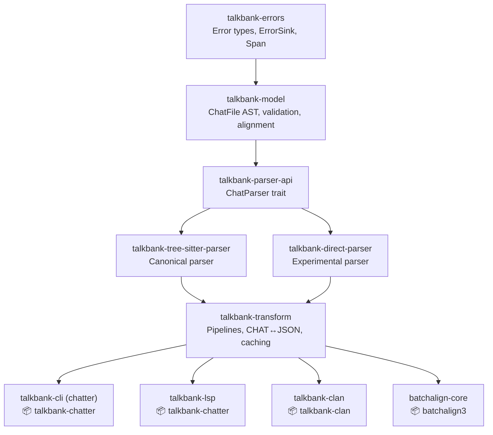

# CLAUDE.md

This file provides guidance to Claude Code (claude.ai/code) when working with code in this repository.

## Overview

TalkBank development workspace — a git meta-repo that tracks cross-repo coordination files while sub-repos are gitignored with independent histories. TalkBank provides tools for linguistic research on conversational data in CHAT format (Codes for the Human Analysis of Transcripts).

Data flows: **spec** (source of truth) → **grammar** (tree-sitter) → **Rust** (parsers, model, validation) → **applications** (CLI, LSP, VS Code, Python pipeline).

## Workspace Layout

This meta-repo tracks:
- `Makefile` — cross-repo build/test/status commands
- `RELEASE-PLAN.md` — coordinated release planning
- `analysis/` — workspace-wide audits and reports
- `scripts/` — one-off maintenance scripts
- `.claude/skills/` — 8 workspace skills: bump, cascade, clan-command, debug-ui, doc-reorg, doc-search, doc-update, verify

Sub-repos are gitignored. Each has its own git history, CLAUDE.md, and build system.

## Repositories

| Directory | Purpose | Language |
|-----------|---------|----------|
| `tree-sitter-talkbank/` | Tree-sitter grammar for CHAT format | JavaScript/C |
| `talkbank-chat/` | CHAT spec, core Rust crates (parsing, model, validation, transform) | Rust |
| `talkbank-chatter/` | CLI (`chatter`), LSP server, VS Code extension | Rust/TypeScript |
| `talkbank-clan/` | CLAN analysis commands (FREQ, MLU, MLT, etc.) | Rust |
| `batchalign3/` | ASR, forced alignment, morphosyntax pipeline | Python/Rust (PyO3) |
| `batchalign-hk-plugin/` | HK deployment plugin for batchalign | Python |
| `talkbank-private/` | Internal archive, deploy scripts, ops docs | |

## Cross-Repo Commands

```bash
make status      # Git status across all repos
make check       # Cargo check all Rust repos
make test        # Run tests across repos
make verify-all  # Full cross-repo verification gate
make clone       # Clone all repos fresh (for new machines)
make pull        # Pull all repos
```

For per-repo commands, see each repo's CLAUDE.md.

## Cross-Repo Architecture

### Crate Dependency Flow (Rust)



Supporting crates: `talkbank-derive` (proc macros), `talkbank-json` (schema validation), `talkbank-pipeline` (config types), `talkbank-highlight` (syntax highlighting), `talkbank-parser-tests` (equivalence tests), `send2clan-sys` (FFI to CLAN).

### Content Walker (shared primitive)

`talkbank-model` exports `for_each_leaf()` / `for_each_leaf_mut()` — closure-based walkers that centralize the recursive traversal of `UtteranceContent` (24 variants) and `BracketedItem` (22 variants). Callers provide only a leaf-handling closure receiving `ContentLeaf` or `ContentLeafMut` (Word, ReplacedWord, or Separator).

Domain-aware gating is built in: `Some(Mor)` skips retrace groups, `Some(Pho|Sin)` skips PhoGroup/SinGroup, `None` recurses everything. Used by `talkbank-model` (%wor generation) and `batchalign-chat-ops` (word extraction, FA injection/postprocess).

### Cross-Repo Path Dependencies

All Rust repos use local path dependencies. The sibling directory layout is load-bearing:

```
~/talkbank/
├── tree-sitter-talkbank/       # Grammar (referenced by talkbank-chat and talkbank-chatter)
├── talkbank-chat/              # Core crates (referenced by all other Rust repos)
│   └── crates/                 # talkbank-errors, talkbank-model, talkbank-transform, etc.
├── talkbank-chatter/           # CLI, LSP (depends on talkbank-chat crates + tree-sitter-talkbank)
├── talkbank-clan/              # Analysis (depends on talkbank-chat crates)
├── batchalign3/
│   ├── rust/crates/            # batchalign-core (path deps to talkbank-chat)
│   └── rust-next/crates/       # Standalone Rust server (path deps to talkbank-chat)
└── batchalign-hk-plugin/       # HK deployment plugin
```

## Critical Policies

### Reference Corpus
`talkbank-chat/corpus/reference/` (73 files) must pass parser equivalence at 100%. If a grammar/parser change breaks even one file, revert immediately.

### Grammar Change Workflow
`parser.c` is generated from `grammar.js` — never edit it directly. After any `grammar.js` change:
1. `tree-sitter generate` (mandatory, including after reverts)
2. `tree-sitter test`
3. `cargo test -p talkbank-tree-sitter-parser && cargo test -p talkbank-parser-tests`
4. Verify reference corpus

### CHAT Handling — No Text Hacking
All CHAT parsing and serialization must go through AST manipulation (Rust crates or `batchalign_core`), never ad-hoc string/regex manipulation. This applies to both Rust and Python code.

### Generated Files
Never hand-edit generated artifacts (`parser.c`, `tree-sitter-talkbank/test/corpus/`, generated Rust tests). Regenerate from their source inputs.

**Cross-repo generation:** `make test-gen` (run from `talkbank-chat/`) writes tree-sitter grammar test corpus into `../tree-sitter-talkbank/test/corpus/`. After spec changes, commit in both repos.

### Cache Policy
The validation cache (`~/.cache/talkbank-utils/talkbank-cache.db`) contains results for 95,000+ files. Never delete it. Use `--force` to refresh specific paths.

## Rust Coding Standards

Universal standards for all Rust code across the workspace. Per-repo CLAUDE.md files carry an identical copy of these standards plus domain-specific additions.

### Edition and Tooling
- Rust **2024 edition**.
- `cargo fmt` before committing. Use `cargo fmt` (not standalone `rustfmt`) for workspace-consistent formatting.
- **Prefer `cargo nextest run`** for faster parallel-per-test execution. Use `cargo test --doc` for doctests (nextest can't run those).
- Run `cargo clippy --all-targets -- -D warnings` periodically (dedicated lint passes), not on every change. Fix real issues; do not silence with `#[allow(clippy::...)]` without explicit approval.

### Error Handling
- **No panics for recoverable conditions.** Use typed errors (`thiserror`); use `miette` for rich diagnostics where appropriate.
- **No silent swallowing.** Every unexpected condition must be handled with explicit error reporting — no `.ok()`, `.unwrap_or_default()`, or silent fallbacks that hide bugs.

### Output and Logging
- **Library code:** `tracing` macros (`tracing::info!`, `tracing::warn!`, etc.) — never `println!`/`eprintln!`.
- **CLI binaries:** `println!`/`eprintln!` for user-facing output; `tracing` for debug logging.
- **Test code:** `println!` is acceptable (cargo captures it).

### Lazy Initialization
- `LazyLock<Regex>` (from `std::sync`) for constant regex patterns. Never call `Regex::new()` inside functions or loops.
- `OnceLock` for per-instance memoization of runtime-determined values.
- Prefer `const` when possible (even better than lazy).
- All lazy init via `std::sync` — no external crate dependencies needed.

### Type Design
- **No boolean blindness.** Enums over bools for anything beyond simple on/off. This is a hard rule.
  - **Banned:** 2+ bool parameters on a function, 2+ related bool fields on a struct, opposite bool pairs (`foo`/`no_foo`), bool return where meaning is unclear without reading docs.
  - **Rust:** `#[derive(Default, clap::ValueEnum)]` enum with named variants. For clap CLI args, use `#[arg(value_enum)]` instead of `--flag`/`--no-flag` pairs.
  - **Python:** `enum.Enum` or `typing.Literal["option1", "option2"]` for multi-way choices. `bool` only for simple on/off.
  - **TypeScript:** Union types (`type Mode = 'auto' | 'force' | 'disable'`) or enums. `boolean` only for simple on/off.
  - **OK as bool:** `verbose`, `force`, `quiet`, `test_echo`, `dry_run`, single `include_*`/`skip_*` flags — anything where the parameter name fully communicates what `true` means.
  - **Not OK as bool:** engine selection (`whisper: bool, rev: bool`), mode switching (`tui: bool, no_tui: bool`), `valid: bool` return from cache (use `enum CacheOutcome { Valid, Invalid }`).
- **`BTreeMap` for deterministic JSON** in tests and snapshot tests (not `HashMap`). Ensures consistent, reviewable diffs.
- Prefer explicit enums over ambiguous `Option` when there are multiple meaningful states.

### Newtypes Over Primitives
- **No primitive obsession.** Domain values must have domain types. Function signatures should be self-documenting through type names, not parameter names.
- **Rust:** Use newtype structs (e.g., `struct TimestampMs(u64)`, `struct SpeakerId(String)`) or the `interned_newtype!` macro from `talkbank-model`. Newtypes should implement `Display`, `From`/`Into` for the underlying type, and derive `Clone`, `Debug`, `PartialEq`, `Eq` as appropriate.
- **Python:** Use `typing.NewType` (e.g., `TimestampMs = NewType("TimestampMs", int)`) or Pydantic constrained types at module/IPC boundaries. For lightweight internal use, `type` aliases are acceptable when they clarify intent.
- **Scope:** Applies to public API boundaries, struct fields, and function signatures. Local variables inside a function body may use bare primitives when the context is unambiguous.
- **Common domain types to prefer over bare primitives:**
  - Timestamps/durations: `TimestampMs`, `DurationMs` (not bare `u64`/`int`)
  - Speaker identifiers: `SpeakerId` (not bare `String`/`str`)
  - Language codes: `LanguageCode` (not bare `String`/`str`)
  - File paths: `AudioPath`, `ChatFilePath` (not bare `String`/`str`)
  - Counts: named newtypes when ambiguity exists (word count vs morpheme count)
- **Parsing boundaries:** Parse raw strings into newtypes at the boundary (file I/O, CLI args, IPC). Interior code should never handle raw strings for typed values.
- **No ad-hoc format parsing.** Use real parsers (XML: `quick-xml`, JSON: `serde_json`, etc.) not regex or string splitting for structured formats. Regex is appropriate only for flat text pattern matching (search, normalization, validation of simple formats).

### File Size Limits
- **Recommended:** ≤400 lines per file.
- **Hard limit:** ≤800 lines per file (must be split).

### Refactoring Triggers
Stop and refactor when you see:
- `x: i32, y: i32` for domain data → use domain structs
- `start_ms: u64, end_ms: u64` → use `TimestampMs` newtype or `TimeSpan` struct
- `fn foo(lang: &str, speaker: &str, path: &str)` → use `LanguageCode`, `SpeakerId`, typed path
- Multiple booleans for state → use enum with variants (see boolean blindness rule above)
- `fn foo(a: bool, b: bool)` or `--flag`/`--no-flag` pairs → use enum with `clap::ValueEnum`
- `fn parse() -> Option<T>` where failure reason matters → use `Result<T, ParseError>`
- `match s { "win" => ... }` on raw strings → parse to `enum` at boundary
- Regex or `split()`/`find()` on XML, JSON, or other structured formats → use a proper parser

### Mermaid Diagrams

**Use Mermaid diagrams extensively** to illustrate data flows, architecture, and processing pipelines in all documentation (CLAUDE.md files, mdBook pages, READMEs). GitHub renders Mermaid natively in Markdown; all mdBook builds have `mdbook-mermaid` enabled.

When to add a diagram:
- **Data flow pipelines** — parsing, validation, alignment, orchestration, IPC
- **Architecture boundaries** — what owns what, where data crosses between Rust/Python/TypeScript
- **State machines** — job lifecycle, daemon states, worker states
- **Decision trees** — dispatch routing, filter chains, cache hit/miss logic
- **Type relationships** — trait hierarchies, crate dependencies

Diagram guidelines:
- Use `flowchart TD` or `flowchart LR` for data flows and pipelines
- Use `sequenceDiagram` for request/response protocols (IPC, HTTP, LSP)
- Use `stateDiagram-v2` for lifecycle/state machines
- Use `classDiagram` for trait hierarchies and type relationships
- Keep diagrams focused — one concept per diagram, not everything-on-one-page
- Place diagrams inline near the text they illustrate, not in a separate section
- Prefer diagrams over ASCII art for anything with more than 3 nodes

### Git
Conventional Commits format: `<type>[scope]: <description>`
Types: `feat`, `fix`, `docs`, `style`, `refactor`, `perf`, `test`, `build`, `ci`, `chore`

## Per-Repo Guidance

Each repo has its own CLAUDE.md (37 files, ~3,800 lines total). Key entry points:

| Repo | CLAUDE.md | Lines | Sub-files |
|------|-----------|-------|-----------|
| `tree-sitter-talkbank/` | `CLAUDE.md` | 95 | — |
| `talkbank-chat/` | `CLAUDE.md` | 254 | 13 (crates, spec, fuzz) |
| `talkbank-chatter/` | `CLAUDE.md` | 147 | 5 (crates, vscode) |
| `talkbank-clan/` | `CLAUDE.md` | 75 | — |
| `batchalign3/` | `CLAUDE.md` | 394 | 10 (rust, rust-next, frontend) |
| `batchalign-hk-plugin/` | `CLAUDE.md` | 155 | — |
| `talkbank-private/` | — | — | — |
