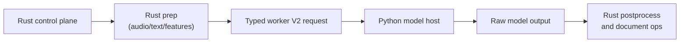

# Final Python Cutover Checklist

**Status:** Current  
**Last verified:** 2026-03-14

This page is the concrete endgame checklist for making Python in
`batchalign3` as thin as possible.

The target state is strict:

- Python loads model runtimes and calls them.
- Rust owns preprocessing, postprocessing, orchestration, caching, incremental
  logic, validation, and document mutation.
- Any Python logic that is not irreducible model-host work should either move
  to Rust or be explicitly quarantined as temporary compatibility debt.

This page is narrower than [Worker Protocol V2](worker-protocol-v2.md). That
document explains the redesign. This page tracks what remains before the
cutover is truly finished.

## Done Definition

The Python cutover is complete only when all of the following are true:

1. All audio inference tasks (ASR, FA, speaker, opensmile, avqi) use typed V2
   worker requests/responses. Text-only NLP tasks (morphotag, utseg, translate,
   coref) use V1 `batch_infer` by design for cross-file GPU batching.
2. Python does not own shared preprocessing for local ASR, FA, or speaker.
3. Python does not own shared postprocessing for ASR, FA, or speaker.
4. Remaining V1 `batch_infer` routes are explicitly documented as
   architecturally appropriate for their use case (cross-file GPU batching).
5. No production task depends on monkeypatch-style global runtime mutation.
6. Rust-side docs describe Python as a model host, not a workflow layer.

## Current State

### Effectively done

- ASR
  Rust owns request shaping and shared normalization.
  Python returns raw Whisper chunks or provider monologues through live V2.
- Forced alignment
  Rust owns request shaping, prepared artifacts, and timing interpretation.
  Python returns raw token/indexed timings through live V2.
- Direct pipeline orchestration
  The old Python pipeline surface is no longer the architecture center.

### Completed in the current cutover

- Speaker diarization
  Speaker is now a live V2 task with Rust-prepared audio only. That keeps the
  Python side at the model-host boundary while preserving the batchalign2
  product surface, where diarization belongs to `transcribe_s` rather than to a
  standalone CLI `speaker` command.

### Intentionally V1

Text-only NLP tasks remain on V1 `batch_infer` by design. These tasks benefit
from cross-file GPU batching — pooling utterances from all files into a single
`batch_infer` call for efficient GPU utilization:

- **morphotag** — Stanza POS/lemma/depparse
- **utseg** — Stanza constituency-based utterance segmentation
- **translate** — Google Translate / Seamless M4T
- **coref** — Stanza coreference resolution

These are not migration targets. V1 `batch_infer` is the correct architecture
for cross-file text NLP.

## End-State Architecture

Rules:

- Rust prepares model-ready inputs.
- Python does not reopen source media just to do shared prep that Rust could
  have done once.
- Python returns raw model outputs, not CHAT-aware or command-aware results.
- Rust owns reuse, retry, validation, and reinjection.

## 1. Finish speaker cutover — Complete

### Goal

Keep `speaker` aligned with the ASR/FA ownership model while preserving
batchalign2 functionality: diarization stays available, but Python only hosts
the diarization runtime and Rust owns request shaping.

### Resolved state

- live V2 routing exists
- typed request/result exist
- Rust-prepared audio is the only speaker transport
- Python returns raw speaker segments
- the old `batch_infer(task="speaker")` path is gone
- the NeMo override is isolated to a narrow worker-local seam

### Behavioral note

- batchalign2 never exposed a standalone CLI `speaker` command
- batchalign3 should preserve diarized transcription behavior through
  `transcribe_s` / `--diarize`, while keeping low-level `speaker` as a typed
  worker capability rather than a public command myth

### Exit criteria

- `speaker` no longer needs the legacy `batch_infer` route
- `speaker` no longer keeps the compatibility media-path branch alive
- NeMo override debt is either removed or isolated behind a documented narrow
  seam with tests

## 2. Migrate remaining media-analysis tasks or quarantine them explicitly — Complete

### Goal

Keep `opensmile` and `avqi` on the typed V2 worker model and remove their last
legacy dispatch hooks.

### Work items

- Keep the typed request/result payloads in sync across Rust and Python.
- Keep request shaping in Rust.
- Remove generic V1 dispatch usage.
- Keep docs and fixtures aligned with the V2-only production path.

### Exit criteria

- no ambiguous half-legacy task ownership
- every remaining V1 task is either gone or intentionally fenced off

## 3. Delete dead V1 worker paths — Complete

### Goal

After migrations are complete, remove worker code that only exists to support
now-dead routes.

### Candidate deletions

- legacy `batch_infer` handlers for tasks already on V2
- any dead request DTO shapes in V1 worker types
- bootstrap wiring that only exists for removed batch-infer tasks
- documentation that still presents V1 as the main architecture

### Work items

- run repo-wide searches for:
  - `batch_infer`
  - `InferTask::Speaker`
  - `ProcessRequest`
  - `InferRequest`
  - `BatchInferRequest`
  - `execute_v2`
- classify each remaining hit as:
  - still needed
  - compatibility-only
  - dead
- remove dead paths in the same change as their last production caller

### Exit criteria

- no production code path uses V1 for tasks already migrated to V2
- V1 types are visibly smaller and obviously transitional

## 4. Minimize Python-side model adapter logic further

### Goal

Keep only irreducible model/SDK code in Python adapters.

### Work items

- review `batchalign/inference/` module by module:
  - `asr.py`
  - `fa.py`
  - `speaker.py`
  - HK providers
  - any runtime helper that still shapes shared data
- move any remaining shared normalization logic into Rust or `batchalign_core`
- keep Python adapters focused on:
  - validate truly model-local input
  - call model/SDK
  - return raw output

### Exit criteria

- Python adapters do not invent shared output schemas beyond the minimum typed
  worker result payload
- provider-agnostic normalization rules exist in Rust, not repeated in Python

## 5. Reconcile capability detection and bootstrap with the new architecture — Complete

### Goal

Make worker startup and capability reporting describe the real architecture,
not legacy command ownership.

### Work items

- audit `_handlers.py`, `_model_loading/`, `_main.py`, and Rust worker-pool
  boot code
- remove assumptions that a task must exist because a V1 route used to exist
- prefer capability reporting in terms of typed worker tasks, not historical
  command names
- tighten docs so “what is loaded” and “what is advertised” stay explicit

### Exit criteria

- capability reporting matches live V2 task support
- no task is advertised through a stale legacy path

## 6. Prove the cutover with tests

### Required test matrix

- Rust drift tests for worker V2 fixtures
- Python drift tests for worker V2 fixtures
- per-task V2 executor tests:
  - ASR
  - FA
  - speaker
- request-builder/result-adapter tests on the Rust side
- worker IPC integration tests that prove V2 requests round-trip end to end
- regression tests for any deleted V1 path to ensure it now fails explicitly

### Flake requirements

- no timing-luck tests
- no network-dependent tests in the default fast suite
- no monkeypatch dependency for core worker seams where a typed fake host can
  be injected instead

## 7. Final documentation cutover

### Goal

Make the docs describe the final architecture cleanly, without transitional
mixed messaging.

### Pages that must be rechecked before calling this done

- [Worker Protocol V2](worker-protocol-v2.md)
- [Python ↔ Rust Interface](../architecture/python-rust-interface.md)
- [Engine Interface](../architecture/engine-interface.md)
- [Architecture Audit](architecture-audit.md)
- [Rust CLI and Server](rust-cli-and-server.md)
- [Testing](testing.md)

### Required doc outcomes

- V2 is described as the real production boundary
- V1 is described only as remaining compatibility debt, if any
- speaker is documented as a prepared-audio V2 worker task, not a standalone CLI
  command
- diagrams reflect the actual task ownership split

## Execution Order

1. finish speaker transport/runtime cleanup
2. migrate or quarantine `opensmile` and `avqi`
3. delete dead V1 routes for migrated tasks
4. tighten capability/bootstrap semantics
5. perform the final documentation sweep

## Concrete Repo Checklist

- [x] `speaker` no longer depends on transitional media-path transport
- [x] NeMo global override is removed or isolated
- [x] no production `batch_infer(task="speaker")`
- [x] no production V1 ASR route
- [x] no production V1 FA route
- [x] remaining V1 tasks are intentionally documented
- [x] `opensmile` decision is made and implemented
- [x] `avqi` decision is made and implemented
- [x] worker capability reporting matches the live task set
- [x] docs/book/diagrams all describe the final task ownership model
- [x] dead code deletion pass completed

## Notes for Future Work

Once this checklist is complete, Python should no longer be a broad
architecture topic. At that point, further Python changes should mostly be:

- adding model runtimes
- updating provider adapters
- handling library-specific runtime quirks

Everything else should default to Rust first.
