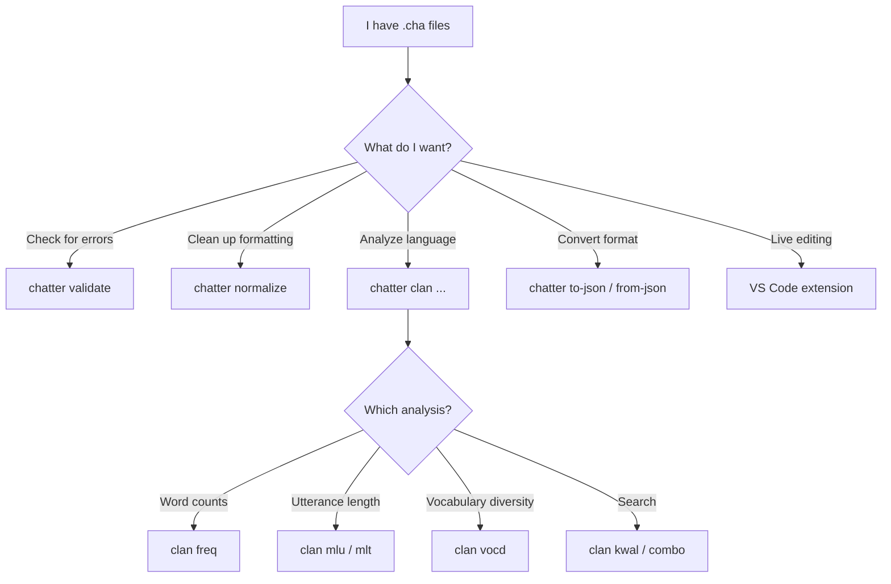
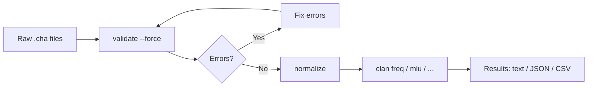

# Book Enhancement Plan — talkbank-tools

Status: planning
Last updated: 2026-03-11

## Current State

57 pages, 100% prose + code blocks + Mermaid diagrams. Zero images, zero
screenshots, zero terminal recordings. Mermaid is used well in Architecture
(15+ diagrams) but absent from user-facing sections. The CLI reference shows
commands but never their output. The VS Code page describes 15+ visual features
with no visuals.

## Enhancement Ideas (ranked by impact-to-effort)

### 1. Captured CLI output in the User Guide

The CLI reference lists commands but never shows what you actually see.
Inline real terminal output for the core workflows — validation with errors,
normalize, to-json. Just fenced `text` blocks with actual output.

**Automatable:** yes — a script runs each command against fixtures and writes
output into markdown includes. mdBook `{{#include}}` supports this. Docs never
go stale.

### 2. VS Code screenshots

The VS Code page describes squiggly underlines, hover popups, alignment
visualization, the validation explorer tree, audio playback controls — all
inherently visual. Priority captures:

- Error squigglies + Problems panel
- Hover alignment popup (%mor/%gra/%pho breakdown)
- Inlay hints showing alignment mismatches
- Validation Explorer tree view
- Audio playback controls / waveform

**Automatable:** partially — initial capture is manual, but could script
VS Code launch + extension host for CI regression.

Store in `book/src/assets/`.

### 3. Before/After CHAT examples in the format section

Concrete before/after pairs: file with problems → corrected version →
validator output. The spec system already has these (constructs/ and errors/),
so a "gallery of common errors" page could be auto-generated from specs.

**Automatable:** yes — generate from spec fixtures.

### 4. Mermaid diagrams in the User Guide

Already configured, used heavily in Architecture, but zero in User Guide.
Candidates:

- CHAT file lifecycle (edit → validate → normalize → commit)
- "Which command do I need?" decision tree
- Error severity/category overview

**Automatable:** no (manual authoring), but easy to write.

### 5. Asciinema recordings for key workflows

Text-based, small, versionable, replayable. Candidates:

- First-time validation of a corpus directory
- `chatter watch` live-revalidation loop
- `chatter clan freq` → `chatter clan mlu` analysis session

Embed in mdBook via HTML snippet. `.cast` files in `book/src/assets/`.

**Automatable:** yes — `asciinema rec` with a script driver.

### 6. Auto-generated cheat sheet / quick-reference

Single dense page: all commands, all flags, all error code categories.
Generate from `chatter --help` + error code enum. Think `tldr` pages.

**Automatable:** yes — parse help output + enum.

### 7. Annotated real-corpus walkthroughs (long-term)

End-to-end tutorial: "I have 50 CHAT files, I want to validate, fix errors,
run FREQ and MLU, export results." Actual file snippets and output at each
step. Highest value for researcher audience, highest effort.

**Automatable:** partially — output capture yes, narrative writing no.

### What to skip or defer

- **Video screencasts**: heavy, unsearchable, stale fast. Screenshots +
  asciinema cover the need.
- **More Mermaid in Architecture**: already good coverage, diminishing returns.
- **Interactive playgrounds (WASM)**: enormous effort, not yet worth it.

---

## Automation Infrastructure

### Self-testing docs (`book/test.sh`)

The biggest long-term win. A script that:
1. Runs every CLI command shown in the book against fixture files
2. Diffs output against what's checked into the markdown (or includes)
3. Fails CI if they diverge

This is how rustdoc keeps code examples accurate. Start with CLI reference,
expand over time.

### mdBook `{{#include}}` pattern

```
book/
  src/
    assets/           # screenshots, .cast files
    cli-output/       # auto-generated output captures
    user-guide/
      cli-reference.md  # uses {{#include ../cli-output/validate-example.txt}}
  test.sh             # regenerate + verify cli-output/
```

---

## Implementation Plan — Phase 1 (easiest, most automatable)

### Step 1: Create the output capture script

Create `book/generate-cli-output.sh` that:

1. Runs a curated set of `chatter` commands against reference corpus files
2. Writes each output to `book/src/cli-output/<name>.txt`
3. Uses `--tui-mode disable` to get plain text (no terminal escape codes)
4. Strips absolute paths (replace with relative `corpus/...` paths)

Commands to capture (initial set):

```bash
# Validation — clean corpus
chatter validate corpus/reference/core/ --tui-mode disable

# Validation — file with errors
chatter validate tests/error_corpus/E2xx_word_errors/E203_invalid_form_marker.cha --tui-mode disable

# Frequency analysis
chatter clan freq corpus/reference/core/basic-conversation.cha --tui-mode disable

# JSON conversion (first 40 lines)
chatter to-json corpus/reference/core/basic-conversation.cha | head -40

# Help output
chatter --help
chatter validate --help
chatter clan --help

# Normalize (show diff-style before/after)
chatter normalize corpus/reference/core/basic-conversation.cha
```

Each output file is named descriptively: `validate-clean.txt`,
`validate-errors.txt`, `freq-basic.txt`, `to-json-snippet.txt`, etc.

### Step 2: Wire includes into cli-reference.md

Replace bare command listings with command + output using mdBook includes:

```markdown
## `validate`

Validate one file or a directory tree of `.cha` files.

\```bash
chatter validate corpus/
\```

\```text
{{#include ../cli-output/validate-clean.txt}}
\```

When errors are found:

\```text
{{#include ../cli-output/validate-errors.txt}}
\```
```

### Step 3: Auto-generate a cheat sheet page

Create `book/generate-cheatsheet.sh` that:

1. Runs `chatter --help` and `chatter clan --help`
2. Parses the command list
3. For each command, runs `chatter <cmd> --help` and extracts the one-liner
4. Formats into a single dense markdown table
5. Appends an error code category summary (parse from spec/errors/ metadata)
6. Writes to `book/src/user-guide/cheatsheet.md`

Output format:

```markdown
# Quick Reference

## Commands

| Command | Description |
|---------|-------------|
| `chatter validate PATH` | Validate CHAT file(s) |
| `chatter normalize INPUT` | Normalize CHAT file to canonical format |
| ... | ... |

## CLAN Analysis Commands

| Command | Description |
|---------|-------------|
| `chatter clan freq` | Word/morpheme frequency counts with type-token ratio |
| ... | ... |

## Error Code Categories

| Range | Category | Example |
|-------|----------|---------|
| E1xx | Encoding | E101: Invalid UTF-8 byte sequence |
| E2xx | Word validation | E203: Invalid form marker |
| ... | ... | ... |
```

Add to SUMMARY.md as a User Guide page.

### Step 4: Add Mermaid diagrams to User Guide pages

Hand-author 2-3 diagrams (not automated, but fast):

**cli-reference.md** — command decision tree:


**batch-workflows.md** — corpus processing pipeline:


### Step 5: Create `book/test.sh` (CI-ready)

```bash
#!/bin/bash
# Regenerate CLI output and check for drift
./book/generate-cli-output.sh
if ! git diff --quiet book/src/cli-output/; then
    echo "CLI output has drifted! Run ./book/generate-cli-output.sh and commit."
    git diff --stat book/src/cli-output/
    exit 1
fi
```

Add to `make verify-all` or CI.

### Step 6: Create `book/src/assets/` and add .gitkeep

Prepare the directory for VS Code screenshots (manual, Phase 2) and
future asciinema `.cast` files.

---

## Phase 2 (manual effort, do after Phase 1)

- [ ] Capture VS Code screenshots for the 5 priority features
- [ ] Write the "Common Errors Gallery" page (auto-generated from specs)
- [ ] Record 2-3 asciinema sessions for key workflows
- [ ] Write the end-to-end tutorial walkthrough

## Phase 3 (long-term)

- [ ] Auto-generate error gallery from spec/errors/ metadata + fixtures
- [ ] Script VS Code screenshot capture for CI regression
- [ ] Add `book/test.sh` to CI pipeline
